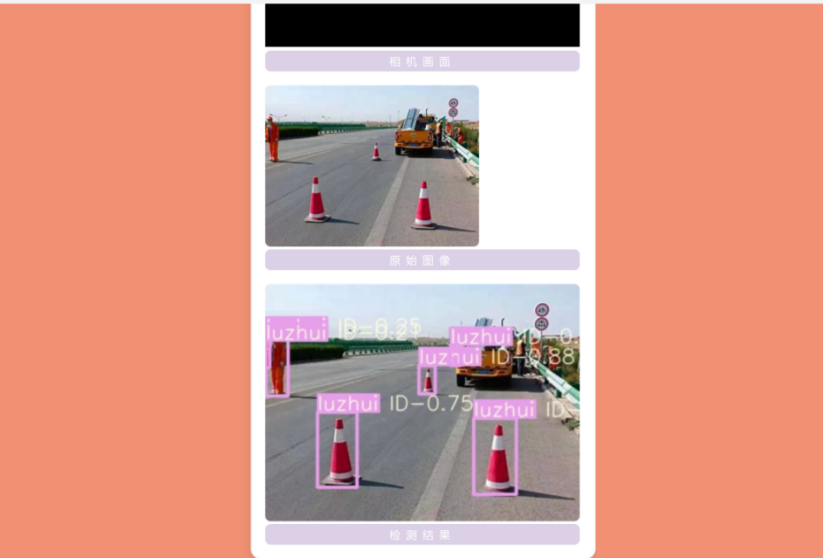
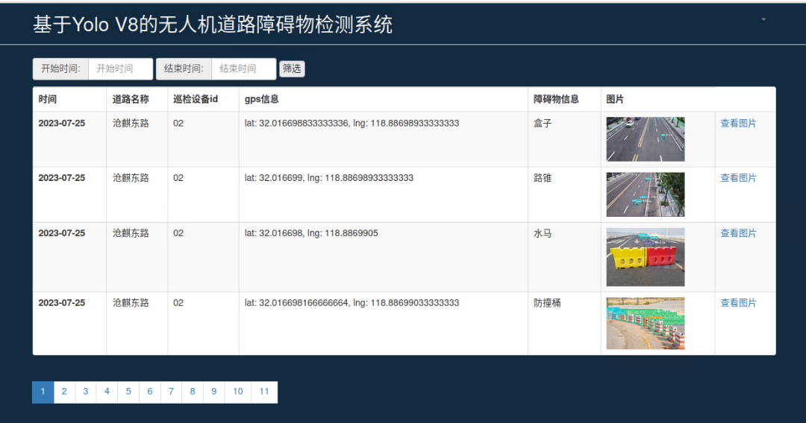
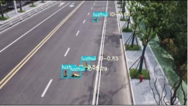
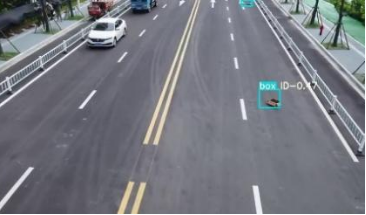

# 基于 YOLOv8 的无人机障碍物识别系统

## 1. 项目简介

本项目是一个**基于 YOLOv8 的无人机障碍物识别系统**，主要用于无人机飞行场景下的实时目标检测与障碍物识别。系统通过无人机搭载摄像头采集图像信息，利用 YOLOv8 模型对图像中的障碍物进行识别与定位，可检测行人、车辆、树木、建筑物、路障等目标，并输出目标类别、位置信息和置信度。

本系统结合前后端开发方式，后端基于 **Flask**，前端基于 **Vue**，实现了图像上传、目标检测、结果展示等功能。该系统可应用于无人机巡检、智能导航、低空监测、环境感知等场景，为无人机自主避障与智能飞行提供支持。

---

## 2. 环境配置建议

建议使用 **Anaconda** 管理 Python 虚拟环境及相关依赖包。

安装依赖时一定要注意以下版本之间的对应关系：
- Python
- CUDA
- PyTorch
- torchvision
- torchaudio
- ultralytics

### 查看本机 GPU 信息


```shell
nvidia-smi
```

查看 CUDA 是否安装成功
nvcc -V

安装 GPU 版本 PyTorch

请根据本机 CUDA 版本安装对应版本的 PyTorch。

示例安装命令：
```shell
conda install pytorch torchvision torchaudio pytorch-cuda=11.7 -c pytorch -c nvidia
验证 GPU 是否可用
import torch
print(torch.cuda.device_count())   # GPU 数量，应大于 0
print(torch.cuda.is_available())   # 是否可用，应为 True
```

## 3. 系统效果展示

## 系统效果展示






## 4. 项目结构
.
├── back-end                  # Flask 后端
│   ├── app.py
│   ├── processor
│   │   └── AIDetector_pytorch.py
│   ├── weights              # 模型权重
│   ├── static
│   ├── templates
│   └── utils
├── front-end                 # Vue 前端
│   ├── src
│   ├── public
│   └── package.json
├── Readme_assets             # README 图片资源
└── README.md

## 5. YOLOv8 模型训练

YOLOv8 官方项目地址：
Ultralytics YOLO

安装 ultralytics
```shell
pip install ultralytics
```
训练命令示例
```shell
yolo detect train data=data/drone_obstacle.yaml model=yolov8m.pt epochs=100 imgsz=640 batch=8
```
参数说明
data：数据集配置文件
model：预训练模型
epochs：训练轮数
imgsz：输入图像尺寸
batch：批大小
训练参数并不是越大越好，应根据数据集规模、显存大小和实验结果综合调整。

## 6. YOLOv8 模型预测
命令行预测示例
```shell
yolo detect predict model=weights/best.pt source=demo.jpg
Python 调用示例
from ultralytics import YOLO

model = YOLO("weights/best.pt")
results = model("demo.jpg", save=True, conf=0.25)

for result in results:
    boxes = result.boxes
    for box in boxes:
        cls_id = int(box.cls[0])
        conf = float(box.conf[0])
        print(f"class_id: {cls_id}, confidence: {conf:.3f}")
```
系统可输出：
目标类别
边界框坐标
检测置信度
若需要仅检测特定障碍物类别，可在后处理阶段增加类别筛选逻辑。

## 7. 后端部署（开发）

本项目后端基于 Flask 开发，负责接收前端上传的图像并调用 YOLOv8 模型完成检测。

启动后端

在 Flask 后端项目目录下运行：
```shell
python app.py
路由示例
@app.route('/')
def hello_world():
    return redirect(url_for('static', filename='./index.html'))
数据接口示例
@app.route('/testdb', methods=['GET', 'POST'])
def testdb():
    db = SQLManager()
    show_data_db = db.get_list('select * from imginfo ')
    db.close()
    return jsonify({'status': 1,
                    'historical_data': show_data_db})
                    
```
## 8. 前端部署（开发）
本项目前端基于 Vue 开发，实现图像上传、检测结果展示等功能。
安装依赖
```shell
npm install
```
启动前端
```shell
npm run serve
```
若出现 OpenSSL 报错
```shell
set NODE_OPTIONS=--openssl-legacy-provider
```
启动完成后，在浏览器访问本地前端页面即可。


## 9. 项目运行流程
第一步：启动后端服务
python app.py
第二步：启动前端服务
npm install
npm run serve
第三步：打开前端页面

在浏览器中打开本地服务页面，上传无人机采集图像，即可查看障碍物识别结果。

## 10. 更新记录
## V1.0

完成项目基础框架搭建
实现图像上传与目标检测功能
完成前后端联调

## V1.1

将检测模型升级为 YOLOv8
优化障碍物识别效果
改进系统界面展示
支持无人机场景下的障碍物检测任务

## 11. 依赖环境示例

推荐环境如下：
```shell
Python 3.10
torch 1.13.0+cu117
torchvision 0.14.0+cu117
torchaudio 0.13.0+cu117
ultralytics
opencv-python
Flask
Flask-Cors
Flask-SQLAlchemy
numpy
matplotlib
PyYAML
pandas
PyMySQL
```
可使用以下命令查看当前环境：
```shell
conda list
pip list
```